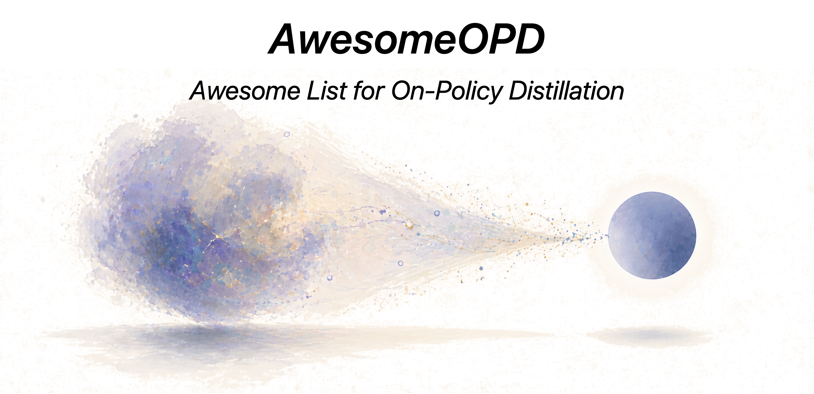

  

 

 

 

# When LLMs Distill On-Policy

**AwesomeOPD** is an awesome list summarising **open-source repositories and papers** for training LLMs (and VLMs / agents / draft models) with **On-Policy Distillation (OPD)** and **On-Policy Self-Distillation (OPSD)**:
 - 🎯 **OPD = C1 + C2.** `C1`: student samples its own trajectories `y ~ π_student(·|x)` during training. `C2`: teacher provides per-token / sequence supervision on those student samples. Methods that only partially satisfy are flagged in **📝 Strictness notes** per section.
 - 🪞 **OPSD** = special case where teacher *is the same model*, conditioned on privileged context (verified trace / answer / "be concise" prefix / longer context) or an earlier checkpoint.
 - 🚀 Each entry is annotated along four design axes — **teacher source** (external · same model with privileged context · earlier checkpoint · multi-teacher · discriminator), **supervision signal** (logits / top-k / sequence reward / verbal score / discriminator / verifier / feature), **rollout consumption** (all / selected / truncated / replaced / as PG samples), and **pipeline slot** (cold-start / mid / RL-replacement / inside-RL / inter-stage / compression / continual-anchor).
 - ⚠️ Built by reading paper PDFs, project pages, and source code with LLM coding agents; manually reviewed but errors possible. PRs welcome.
 - 📌 If you find this repository helpful for your research, please cite it via the **"Cite this repository"** button in the right sidebar of the GitHub page.
 - 📅 Last updated: 2026-05-18

Taxonomy:
 - **📚 Surveys, Foundations & Position Papers** — meta-references and seed papers (GKD, MiniLLM, Thinking Machines blog, Tencent / THUNLP surveys)
 - **🔬 White-Box** — logit-based OPD on student rollouts with an external teacher
 - **🎭 Black-Box** — discriminator / verbal / preference, no teacher logits
 - **♻️ OPSD** — privileged-context self-distillation (same model, different conditioning)
 - **🔁 Iterative Self-Bootstrapping** — same model as previous-checkpoint teacher
 - **🤝 OPD-RL Hybrids** — inside-RL OPD: KL-as-reward, RL+OPD fusion
 - **🧠 Reasoning / 🖼️ Multimodal / 🤖 Agent & Embodied** — by application; cuts across all teacher-source categories
 - **⚡ Speculative-Decoding Distillation** — drafter distillation; "student" is a draft model
 - **🛠️ Frameworks & Toolkits** — what to actually run
 - **🏭 Industrial / Production Reports** — what the labs ship

Shorthand: **FKL** = forward KL · **RKL** = reverse KL · **JSD** = Jensen–Shannon · **Skew-KL** / **AKL** = skewed / adaptive KL · `📄 paper-only` = no public code yet.

## Updates

📢 click to expand

- **2026-05-18** — add COPSD, MSD
- **2026-05-15** — add TCOD, Healthcare AI GYM, HyperEyes (and cross-list Skill-SD into Agent)
- **2026-05-14** — add CORD
- **2026-05-13** — add Uni-OPD; add HY-MT, Baichuan-M3, KAT-Coder-V2, HY-Embodied, Qwen3.5-Omni
- **2026-05-11** — add Skill-SD
- **2026-04-30** — add π-Play
- **2026-04-29** — add SD-Zero, *Why Does Self-Distillation (Sometimes) Degrade Reasoning?*
- **2026-04-28** — initial release; add NPO, VLA-OPD, KDFlow, HPD, DeepSeek-V4

---

## 📚 Surveys, Foundations & Position Papers

| Resource | 🌟 Stars | Date | Org | Paper / Link | Title / Notes |
| :----: | :----: | :----: |  :----: | :----: | :---- |
| [GKD](https://arxiv.org/abs/2306.13649) |  | 2023.06 | Google DeepMind (Agarwal et al.) | [arXiv 2306.13649](https://arxiv.org/abs/2306.13649) — implemented in [TRL `GKDTrainer`](https://github.com/huggingface/trl/blob/main/trl/experimental/gkd/gkd_trainer.py) | **GKD: On-Policy Distillation of Language Models — Learning from Self-Generated Mistakes** (Seminal · ICLR 2024) |
| [Blog](https://thinkingmachines.ai/blog/on-policy-distillation/) |  | 2025.10 | Thinking Machines Lab (Kevin Lu et al.) | [Blog](https://thinkingmachines.ai/blog/on-policy-distillation/) · [tinker-cookbook](https://github.com/thinking-machines-lab/tinker-cookbook) | **Thinking Machines Lab — On-Policy Distillation (blog)** |
| [tinker-cookbook](https://github.com/thinking-machines-lab/tinker-cookbook) |  | 2025.10 | Thinking Machines Lab | — | Reference impl. of the OPD recipe on the Tinker SDK |
| [revisiting_opd](https://github.com/hhh675597/revisiting_opd) |  | 2026.03 | CASIA (Fu et al.) | [arXiv 2603.25562](https://arxiv.org/abs/2603.25562) | Revisiting OPD: Failure Modes & Simple Fixes |
| [Tencent OPD Survey](https://arxiv.org/abs/2604.00626) |  | 2026.04 | Tencent (Mingyang Song & Mao Zheng) | [arXiv 2604.00626](https://arxiv.org/abs/2604.00626) | **A Survey of On-Policy Distillation for LLMs** |
| [OPD](https://github.com/thunlp/OPD) |  | 2026.04 | Tsinghua THUNLP | [arXiv 2604.13016](https://arxiv.org/abs/2604.13016) | **Rethinking On-Policy Distillation: Phenomenology, Mechanism & Recipe** |
| [Lightning OPD](https://arxiv.org/abs/2604.13010) |  | 2026.04 | Wu, Han, Cai | [arXiv 2604.13010](https://arxiv.org/abs/2604.13010) | **Lightning OPD: Efficient Post-Training with Offline OPD** |

📋 Click to view technical details

| Resource | Loss / Divergence | Data | Teacher Access | Granularity | Notes |
| :----: | :----: | :----: | :----: | :----: | :---- |
| GKD (Agarwal) | Generalised JSD (FKL/RKL configurable) | Mixed (`λ` interpolates teacher↔student) | White-box | Token | The seminal paper that named OPD; introduced student-self-rollout supervision. |
| Thinking Machines blog | Reverse KL (student‖teacher) | Student rollouts | White-box | Token | "Swap KL ref model for stronger teacher" recipe; one-line addition to RL trainer. Replicates Qwen3 result at ~1/10 RL cost. |
| Revisiting OPD | Truncated reverse KL + top-p sampling + special-token masking | Student | White-box | Token (filtered) | Diagnoses 3 failure modes: imbalanced one-token signal, unreliable prefix guidance, tokenizer mismatch. |
| Tencent OPD Survey | (survey) | (survey) | (survey) | (survey) | Catalogues 50+ methods; useful as a reference index. |
| THUNLP Rethinking OPD | Reverse KL with progressive top-K alignment | Student | White-box | Token | Identifies two success conditions: compatible thinking patterns + genuinely new teacher capability. Recipe = **off-policy cold-start + teacher-aligned prompt selection**. |
| Lightning OPD | Cached teacher log-probs over SFT rollouts (offline OPD) | Student (cached) | White-box | Token | Introduces "teacher consistency" — same teacher must be used for SFT and OPD or else gradient bias. Eliminates the live teacher server. |

📝 <b>Strictness notes</b> (against the strict OPD definition <code>C1: student samples its own trajectories during training</code> + <code>C2: teacher provides supervision on those samples</code>)

- **Lightning OPD** — ⚠️ partially satisfies C1: teacher log-probs are pre-computed *once* over SFT rollouts and reused during training; student doesn't actively sample during the OPD step. Authors call this "offline OPD" explicitly. Listed in OPD because the data is past-student-generated rollouts, not teacher-generated.

---

## 🔬 OPD with Larger External Teachers — White-Box

White-box methods use **teacher logits / log-probabilities** to supervise the student on **student-generated rollouts**. Each entry below has been verified to (a) train on student rollouts and (b) operate at the token level.

Methods that turned out to be RL-style on verification have been moved to [OPD-RL Hybrids](#-opd-rl-hybrids); off-policy / pure-loss-function / pretraining-side methods are excluded from this list.

| Resource | 🌟 Stars | Date | Org | Paper Link | Title / Notes |
| :----: | :----: | :----: |  :----: | :----: | :---- |
| [LMOps `/minillm`](https://github.com/microsoft/LMOps/tree/main/minillm) |  | 2023.06 | Microsoft / Tsinghua | [arXiv 2306.08543](https://arxiv.org/abs/2306.08543) | MiniLLM (ICLR 2024) |
| [distillm](https://github.com/jongwooko/distillm) |  | 2024.02 | KAIST / Microsoft | [arXiv 2402.03898](https://arxiv.org/abs/2402.03898) | DistiLLM (ICML 2024) |
| [google-research `/speculative_kd`](https://github.com/google-research/google-research/tree/master/speculative_kd) |  | 2024.10 | UCSB / Google | [arXiv 2410.11325](https://arxiv.org/abs/2410.11325) | Speculative KD (ICLR 2025) |
| [distillm-2](https://github.com/jongwooko/distillm-2) |  | 2025.03 | KAIST / Microsoft | [arXiv 2503.07067](https://arxiv.org/abs/2503.07067) | DistiLLM-2 (ICML 2025 Oral) |
| [DSKDv2](https://github.com/songmzhang/DSKDv2) |  | 2025.04 | BJTU | [arXiv 2504.11426](https://arxiv.org/abs/2504.11426) | DSKDv2 — cross-tokenizer; supports on-policy mode |
| [Constrained OPD](https://arxiv.org/abs/2509.22921) |  | 2025.09 | Huawei Noah's Ark | [arXiv 2509.22921](https://arxiv.org/abs/2509.22921) | Constrained OPD (CMDP) |
| [AdaSwitch](https://arxiv.org/abs/2510.07842) |  | 2025.10 | RUC / Baidu | [arXiv 2510.07842](https://arxiv.org/abs/2510.07842) | AdaSwitch (on-/off-policy switching) |
| [Veto](https://arxiv.org/abs/2601.07155) |  | 2026.01 | SNU | [arXiv 2601.07155](https://arxiv.org/abs/2601.07155) | Veto (Stable OPD) — ACL 2026 Findings |
| [G-OPD](https://github.com/RUCBM/G-OPD) |  | 2026.02 | RUC / Tencent | [arXiv 2602.12125](https://arxiv.org/abs/2602.12125) | G-OPD |
| [Fast OPD](https://arxiv.org/abs/2602.15260) |  | 2026.02 | Industrial | [arXiv 2602.15260](https://arxiv.org/abs/2602.15260) | Fast OPD (prefix-truncated) |
| [Entropy-Aware OPD](https://arxiv.org/abs/2603.07079) |  | 2026.03 | KAIST / IBM | [arXiv 2603.07079](https://arxiv.org/abs/2603.07079) | Entropy-Aware OPD |
| [REOPOLD](https://arxiv.org/abs/2603.11137) |  | 2026.03 | KAIST / Microsoft | [arXiv 2603.11137](https://arxiv.org/abs/2603.11137) | REOPOLD (Relaxed OPD) — code soon |
| [OPSD_OnPolicyDistillation](https://github.com/HJSang/OPSD_OnPolicyDistillation) |  | 2026.03 | LinkedIn | [arXiv 2603.11178](https://arxiv.org/abs/2603.11178) | PACED — frontier curriculum self-distill |
| [TSD-KD](https://github.com/kmswin1/TSD-KD) |  | 2026.03 | Korea Univ. | [arXiv 2603.13260](https://arxiv.org/abs/2603.13260) | TSD-KD — token-selective dual KD (ICLR 2026) |
| [SCOPE](https://github.com/machine981/SCOPE) |  | 2026.04 | USTC / Meituan / Fudan | [arXiv 2604.10688](https://arxiv.org/abs/2604.10688) | SCOPE — signal-calibrated dual-path |
| [OPSD_OnPolicyDistillation](https://github.com/HJSang/OPSD_OnPolicyDistillation) |  | 2026.04 | Meta / LinkedIn | [arXiv 2604.14084](https://arxiv.org/abs/2604.14084) | TIP — Token Importance, shares LinkedIn OPSD repo with PACED |
| [Hybrid-Policy-Distillation](https://github.com/zwhong714/Hybrid-Policy-Distillation) |  | 2026.04 | zwhong714 | [arXiv 2604.20244](https://arxiv.org/abs/2604.20244) | HPD — Hybrid Policy Distillation; LlamaFactory + verl backends |

📋 Click to view technical details

| Method | Loss / Divergence | Data | Granularity | Domain | Notes |
| :----: | :----: | :----: | :----: | :----: | :---- |
| MiniLLM | Reverse KL via policy gradient | Student | Sequence (PG) | General | The seminal "OPD" recipe by Yuxian Gu et al.; predates GKD by days. Mode-seeking. |
| DistiLLM | Skewed-KL (mix of FKL/RKL) | Mixed (adaptive off→on, with student samples) | Token | General | Skew parameter `α` interpolates between FKL and RKL; importance-reweighted student samples. |
| Speculative KD (Xu) | Interleaved propose-and-correct (gated KL) | Student-proposed, teacher-corrected | Token | General | Bridges teacher-student gap via interleaved sampling. |
| DistiLLM-2 | Contrastive: Skew-FKL on teacher data + Skew-RKL on student data | Mixed | Token | General | Asymmetric losses on each data source; ICML 2025 oral. |
| DSKDv2 | KL in dual aligned space; explicit on-policy mode | Student | Token | Cross-tokenizer | Cross-vocabulary distillation; supports both on/off-policy. |
| Constrained OPD | KL-constrained CMDP | Student | Token | General | Hard KL constraint instead of soft penalty. Borderline OPD-RL. |
| AdaSwitch | Adaptive on/off-policy switching | Mixed | Token | General | Switches between teacher-data and student-rollout based on divergence threshold. |
| Veto | Logit-space geometric bridge with adaptive gradient veto | Student | Token | General | Adaptive Target Reformulation. |
| G-OPD / ExOPD | Reverse KL + scaled reward extrapolation | Student | Token | General | Generalises OPD as KL-constrained RL; allows reward scale > 1 to "exceed" the teacher. |
| Fast OPD | Prefix-truncated distillation reducing FLOPs | Student | Token (truncated) | Reasoning | 2× to 47× speedup via reasoning-prefix truncation. |
| Entropy-Aware OPD | Switch between FKL and RKL based on teacher entropy | Student | Token | Reasoning | When teacher entropy high → FKL; low → RKL. |
| REOPOLD | Mixture-based reward clipping + entropy-based dynamic sampling | Student | Token | Reasoning | "Relaxed OPD"; views OPD as policy optimisation with teacher-student log-ratio reward. |
| PACED | Frontier curriculum at student competence boundary | Student | Token | General | Self-distill style (privileged-context / earlier-checkpoint); difficulty weighting `w(p)=p(1−p)`. |
| TSD-KD | Indirect (student-propose / teacher re-rank) + direct selective logit KD | Mixed | Token (selected) | General | Hybrid; partial OPD + partial preference. |
| SCOPE | Teacher-PPL-weighted KL on incorrect rollouts; student-PPL-weighted MLE on correct | Student | Token | Reasoning | Signal-Calibrated OPD with Dual-Path Adaptive Weighting; verifier-routing. |
| TIP | Top-50% high-entropy student tokens carry the OPD signal | Student (selected) | Token (filtered) | Reasoning | ~47% memory savings; only entropy-high student tokens trained. |
| HPD | Reweighted log-likelihood unifying FKL + RKL | Mixed (off-policy + lightweight approximate on-policy sampling) | Token | General | Unifies KD as token-level reweighted likelihood; lightweight on-policy sampling preserves training efficiency. |

---

## 🎭 OPD with Black-Box / Outcome-Based Teachers

When the teacher is **API-only** (no logits), OPD uses scalar rewards, verbal scores, preferences, or adversarial discriminators — all evaluated on **student rollouts**. Entries that turned out to use static teacher data only (Lion, SuperCorrect, DAIL, SODA) are excluded from this list.

| Resource | 🌟 Stars | Date | Org | Paper Link | Title / Notes |
| :----: | :----: | :----: |  :----: | :----: | :---- |
| [ORPO-Distill](https://arxiv.org/abs/2509.25100) |  | 2025.09 | Industrial | [arXiv 2509.25100](https://arxiv.org/abs/2509.25100) | ORPO-Distill |
| [LMOps `/gad`](https://github.com/microsoft/LMOps) |  | 2025.11 | Microsoft Research | [arXiv 2511.10643](https://arxiv.org/abs/2511.10643) · [project](https://ytianzhu.github.io/Generative-Adversarial-Distillation/) | GAD — Black-Box OPD |
| [OVD](https://arxiv.org/abs/2601.21968) |  | 2026.01 | HKU / Huawei | [arXiv 2601.21968](https://arxiv.org/abs/2601.21968) | OVD (On-policy Verbal Distillation) — project page `OVD.github.io` 404s |

📋 Click to view technical details

| Method | Feedback Signal | Data | Granularity | Domain | Notes |
| :----: | :----: | :----: | :----: | :----: | :---- |
| ORPO-Distill | Student-Generated Outputs (SGO) + ORPO contrastive | Mixed (student-generated negatives, teacher positives) | Sequence | Cross-architecture | "Mixed-policy strategy utilizing student-generated outputs"; NeurIPS 2025 WS. |
| GAD (Generative Adversarial Distillation) | Discriminator (on-policy reward model) | Student | Sequence | General | A trained discriminator distinguishes student outputs from teacher (e.g. GPT-5) responses; minimax game makes the discriminator co-evolve into an on-policy reward model. Qwen2.5-14B student becomes comparable to GPT-5-Chat on LMSYS. |
| OVD | Verbal scores (0–9) on student trajectories | Student | Sequence | General | Replaces token-level logit matching with verbal scoring; +25.7% over baselines. |

---

## ♻️ Self-Distillation with Privileged Context — OPSD

**Same model = teacher = student**, but the teacher is conditioned on something the student doesn't see (verified trace, ground-truth answer, "be concise" prefix, longer context, document, …). The gap exists *because of the conditioning*, not weights.

Several entries previously listed here turned out on verification to use static teacher data or a fixed self-rewritten dataset rather than student rollouts; those have been excluded. SPIN was reclassified to [Iterative Self-Bootstrapping](#-iterative-self-bootstrapping).

| Resource | 🌟 Stars | Date | Org | Paper Link | Title / Notes |
| :----: | :----: | :----: |  :----: | :----: | :---- |
| [OPSD](https://github.com/siyan-zhao/OPSD) |  | 2026.01 | UCLA / Meta FAIR | [arXiv 2601.18734](https://arxiv.org/abs/2601.18734) · [blog](https://siyan-zhao.github.io/blog/2026/opsd/) | OPSD — Self-Distilled Reasoner |
| [Self-Distillation](https://github.com/idanshen/Self-Distillation) |  | 2026.01 | MIT / ETH | [arXiv 2601.19897](https://arxiv.org/abs/2601.19897) | SDFT-Continual |
| [mtp-lm](https://github.com/jwkirchenbauer/mtp-lm) |  | 2026.02 | UMD / LLNL | [arXiv 2602.06019](https://arxiv.org/abs/2602.06019) | MTP Self-Distill |
| [LMOps `/opcd`](https://github.com/microsoft/LMOps) |  | 2026.02 | Microsoft Research | [arXiv 2602.12275](https://arxiv.org/abs/2602.12275) | OPCD — On-Policy Context Distillation |
| [GATES](https://arxiv.org/abs/2602.20574) |  | 2026.02 | UMD | [arXiv 2602.20574](https://arxiv.org/abs/2602.20574) | GATES (Self-Distillation under Privileged Context) |
| [CRISP_Reasoning_Compression](https://github.com/HJSang/CRISP_Reasoning_Compression) |  | 2026.03 | LinkedIn | [arXiv 2603.05433](https://arxiv.org/abs/2603.05433) | OPSDC / CRISP |
| [LMOps `/oel`](https://github.com/microsoft/LMOps) |  | 2026.03 | Microsoft Research | [arXiv 2603.16856](https://arxiv.org/abs/2603.16856) | OEL — Online Experiential Learning |
| [self-distillation-analysis](https://github.com/beanie00/self-distillation-analysis) |  | 2026.03 | MSR / KAIST / SNU | [arXiv 2603.24472](https://arxiv.org/abs/2603.24472) | **Why Does Self-Distillation (Sometimes) Degrade Reasoning?** — diagnostic study of OPSD failure modes |
| [ml-ssd](https://github.com/apple/ml-ssd) |  | 2026.04 | Apple MLR | [arXiv 2604.01193](https://arxiv.org/abs/2604.01193) | Apple — Embarrassingly Simple Self-Distillation |
| [Skill-SD](https://skill-sd.github.io/) |  | 2026.04 | UCAS / CUHK / USTC / vivo AI Lab | [arXiv 2604.10674](https://arxiv.org/abs/2604.10674) | **Skill-SD** — skill-conditioned OPSD for multi-turn LLM agents |
| [SD-Zero](https://arxiv.org/abs/2604.12002) |  | 2026.04 | Princeton / Toronto / CMU | [arXiv 2604.12002](https://arxiv.org/abs/2604.12002) | **SD-Zero** — Self-Revision turns binary rewards into dense supervision |
| [π-Play](https://arxiv.org/abs/2604.14054) |  | 2026.04 | CASIA / UCAS / Meituan | [arXiv 2604.14054](https://arxiv.org/abs/2604.14054) | **π-Play** — multi-agent self-play turns the question-construction path into privileged context for OPSD on search agents |
| [OPSDL](https://arxiv.org/abs/2604.17535) |  | 2026.04 | Baidu | [arXiv 2604.17535](https://arxiv.org/abs/2604.17535) | OPSDL (Long-Context Self-Distillation) |
| [MSD](https://arxiv.org/abs/2605.02971) |  | 2026.05 | Tongji / Shanghai AI Lab | [arXiv 2605.02971](https://arxiv.org/abs/2605.02971) | **MSD** — multilingual safety OPSD; teacher conditioned on English query translation + CoT instruction; DPSW weights safety-critical tokens |
| [COPSD](https://github.com/cisnlp/COPSD) |  | 2026.05 | LMU Munich / MCML | [arXiv 2605.09548](https://arxiv.org/abs/2605.09548) | **COPSD** — crosslingual OPSD; teacher sees English problem translation + reference solution, student rolls out in low-resource language (17 African languages) |

📋 Click to view technical details

| Method | Privileged Context (Teacher) | Loss / Divergence | Granularity | Domain | Notes |
| :----: | :----: | :----: | :----: | :----: | :---- |
| OPSD (Self-Distilled Reasoner) | Verified reasoning trace | Per-token RKL with point-wise clipping | Token | Math reasoning | Same-model OPSD; matches GRPO with 1×8 rollouts and 1024 length vs. GRPO's 8×16 / 16k. **The canonical OPSD paper.** Built on TRL's GOLD trainer. |
| SDFT-Continual (idanshen) | Demo-conditioned same model | RKL on student rollouts vs. demo-conditioned teacher | Token | Continual learning | Self-distillation enables continual learning. |
| MTP Self-Distill | Multi-token prediction same model | RKL on student rollouts | Token | General | Multi-Token Prediction via Self-Distillation. Author-stated on-policy. |
| OPCD | In-context-knowledge-augmented same model | RKL on student rollouts | Token | Knowledge internalisation | Internalise context to be faithful even after context is removed. |
| GATES | Document-conditioned tutor (same model) | RKL gated by tutor consensus | Token (gated) | Document QA | Both tutor and student sample rollouts; on-policy student-rollout updates contribute "modest additional improvement" on top of off-policy distillation. Mixed. |
| CRISP / OPSDC | "Be concise" instruction prefix | Per-token RKL on student rollouts | Token | Reasoning compression | Compresses long-CoT without entropy collapse (unlike RL-with-length-penalty). |
| OEL (Online Experiential Learning) | Same model with interactive game environment | RKL on student rollouts | Token | Game / planning | Self-distillation on interactive trajectories. |
| Why-Does-SD-Degrade (analysis) | Varies (controlled study over rich-vs-thin context teachers) | RKL on student rollouts (analysis only) | Token | Math reasoning (in-domain + OOD) | **Diagnostic paper**, not a training method. Finds that conditioning the teacher on richer privileged context suppresses *epistemic verbalization* (uncertainty expression) in the student → fast in-domain gains but up to 40% OOD drops on Qwen3-8B / DeepSeek-Distill-Qwen-7B / Olmo3-7B-Instruct. Implication: privileged-context richness is a double-edged knob in OPSD. |
| Apple SSD | Same model w/ temperature/truncation sampling | Cross-entropy on its own samples | Sequence | Code generation | "Embarrassingly simple" — sample, then SFT on those samples. Degenerate OPSD; "decoding-config" privilege. |
| Skill-SD | Trajectory-derived skill summaries condition the teacher only | GRPO + importance-weighted reverse-KL on student rollouts | Token | Multi-turn agentic tasks (AppWorld, Sokoban) | Extends OPSD to multi-turn agentic interaction with dynamic training-only skills. |
| SD-Zero | Reviser conditioned on generator's response + binary reward | Per-token KL: distill reviser → generator on student rollouts | Token | Math / code reasoning | Single model plays Generator + Reviser; reviser's reward-conditioned token distribution becomes dense supervision over the generator's response. Outperforms RFT, GRPO, SDFT under matched sample budget on Qwen3-4B-Instruct / Olmo-3-7B-Instruct (≥10% over base). Exhibits token-level self-localization and iterative self-evolution. |
| π-Play | Teacher conditioned on **Question Construction Path (QCP)** — the reverse-direction artifact emitted by an examiner agent when it generates the task | Per-token reverse KL on student rollouts; teacher is an EMA copy of the student (τ=0.05) | Token | Search / deep-research / multi-hop QA agents (NQ, TriviaQA, HotpotQA, 2WikiMQA, MuSiQue, …) | Self-play loop *examiner ↔ student/teacher* with no external data. The QCP is privileged because it captures the reverse solution path the examiner used to construct the task; the teacher sees it, the student doesn't. Converts sparse-reward self-play into dense per-token supervision; data-free π-Play surpasses fully supervised search agents and is 2–3× more sample-efficient than conventional self-play. |
| OPSDL | Short-context same model | Point-wise RKL | Token | Long-context | On-Policy Self-Distillation for Long-Context LMs. |
| MSD | English (high-resource) query translation + CoT instruction (privileged *crosslingual* context) | Per-token reverse KL with **Dual-Perspective Safety Weighting (DPSW)**: w_t = w_t^T · w_t^S, combining teacher top-K entropy (safety-criticality) × student disagreement risk (1−p_S) | Token (DPSW-weighted) | Multilingual safety alignment (jailbreak + utility benchmarks; e.g., English → Javanese) | Same model = teacher = student; ships **on-policy MSD** (student samples its own multilingual responses, strict C1+C2) and **off-policy MSD** (teacher-sampled) variants. Requires no translated response data — only multilingual queries. |
| COPSD | English problem translation + reference solution (privileged *crosslingual* context) | Per-token reverse KL with full-vocabulary logit distillation; teacher fixed during training; gradients flow only through student | Token | Multilingual math reasoning (PolyMath, AfriMGSM — 17 low-resource African languages) | Same model serves as both student (rollouts in low-resource language) and teacher (English-conditioned). Transfers a model's own high-resource reasoning behavior to low-resource languages; improves answer-format adherence and test-time scaling. |

📝 <b>Strictness notes</b>

- **Apple SSD** — ⚠️ C2 is degenerate: no teacher KL signal; pure self-generated SFT (sample with temperature/truncation, then SFT on those samples). Closer to STaR-style self-bootstrapping than to OPSD. Kept because the "teacher" is the same model with a different decoding config — privileged-context-by-decoding.
- **GATES** — ⚠️ Authors' own ablation says off-policy trajectory-level distillation drives the *primary gains*; on-policy student-rollout updates contribute only "modest additional improvement". Mixed; the OPSD leg is genuine but secondary.
- **SD-Zero** — privileged context is *non-textual*: the reviser is conditioned on the generator's full response **plus its scalar binary reward**. C1 ✓ (generator samples its own rollouts), C2 ✓ (per-token KL from reviser). Compared head-to-head against GRPO in the paper but is not itself an RL method — there is no policy-gradient objective; the reward is a conditioning signal, not a return. Listed in OPSD rather than OPD-RL Hybrids for that reason.
- **Why-Does-SD-Degrade** — analysis-only; no new training algorithm proposed. Listed here because the failure mode it characterises (epistemic-verbalization collapse under rich privileged context) is specific to OPSD.
- **π-Play** — teacher and student have *separate parameter sets*; the teacher is an EMA-tracking copy of the student rather than literally the same weights. Listed in OPSD because (i) the paper itself frames the method as "Privileged Self-Distillation" and (ii) the gap between teacher and student exists *because of QCP conditioning*, not weight divergence (the EMA target collapses to the student in the limit). C1 ✓ (student samples its own rollouts), C2 ✓ (per-token RKL from QCP-conditioned teacher).

### 🔁 Iterative Self-Bootstrapping

Same model is the teacher, but as a *frozen earlier checkpoint*, not a privileged-context view. The teacher snapshot is frozen for one round, the student trains, then the snapshot rolls forward. Listed separately because the supervision is typically sequence-level / preference, not per-token logit-distillation.

| Resource | 🌟 Stars | Date | Org | Paper Link | Title / Notes |
| :----: | :----: | :----: |  :----: | :----: | :---- |
| [SPIN](https://github.com/uclaml/SPIN) |  | 2024.01 | UCLA | [arXiv 2401.01335](https://arxiv.org/abs/2401.01335) | SPIN — Self-Play Fine-Tuning (ICML 2024) |
| [rStar](https://github.com/microsoft/rStar) |  | 2025.01 | Microsoft Research | [rStar-Math 2501.04519](https://arxiv.org/abs/2501.04519) · [rStar2-Agent 2508.20722](https://arxiv.org/abs/2508.20722) | rStar / rStar-Math / rStar2-Agent |

📝 <b>Strictness notes</b>

- **SPIN** — ⚠️ C1 ✓ (student samples), but C2 fails strict per-token logit form: supervision is *sequence-level DPO preference* against the previous frozen checkpoint. More accurately "iterative on-policy DPO" than per-token OPD. Kept because the "teacher = previous self" pattern is what people search for in OPD lists.
- **rStar / rStar-Math / rStar2-Agent** — ⚠️ MCTS-filtered student samples + SFT; the "teacher signal" is a step-level PPM / discriminator score, not per-token logit KL. Iterative self-improvement, not classical OPD.

---

## 🤝 OPD-RL Hybrids — Inside-RL OPD

Methods that fuse OPD with **RLVR / GRPO / PPO / DPO**. Teacher logits become a dense reward shaping or trust-region anchor inside an RL objective; or BoN / preference signals are used as the imitation target.

| Resource | 🌟 Stars | Date | Org | Paper Link | Title / Notes |
| :----: | :----: | :----: |  :----: | :----: | :---- |
| [BOND](https://arxiv.org/abs/2407.14622) |  | 2024.07 | Google DeepMind | [arXiv 2407.14622](https://arxiv.org/abs/2407.14622) | BOND (Best-of-N Distillation) |
| [Faster WIND](https://arxiv.org/abs/2410.20727) |  | 2024.10 | CMU / Google | [arXiv 2410.20727](https://arxiv.org/abs/2410.20727) | Faster WIND (iterative BoN) — AISTATS 2025 |
| [AlignDistil](https://github.com/songmzhang/AlignDistil) |  | 2025.03 | BJTU / Tencent | [arXiv 2503.02832](https://arxiv.org/abs/2503.02832) | AlignDistil — RLHF-equivalent KD (ACL 2025) |
| [LUFFY](https://github.com/ElliottYan/LUFFY) |  | 2025.04 | Westlake U. | [arXiv 2504.14945](https://arxiv.org/abs/2504.14945) | LUFFY — mixed-policy GRPO |
| [KETCHUP](https://arxiv.org/abs/2504.19024) |  | 2025.04 | U. Alberta | [arXiv 2504.19024](https://arxiv.org/abs/2504.19024) | KETCHUP (k-step RL-KD) |
| [KDRL](https://arxiv.org/abs/2506.02208) |  | 2025.06 | HIT / Huawei | [arXiv 2506.02208](https://arxiv.org/abs/2506.02208) | KDRL (Joint KD + RL) |
| [SDPO](https://github.com/lasgroup/SDPO) |  | 2026.01 | ETH / MIT | [arXiv 2601.20802](https://arxiv.org/abs/2601.20802) · [project](https://self-distillation.github.io/SDPO) | SDPO — RL via Self-Distillation |
| [KEPO](https://github.com/Corleno/KEPO) |  | 2026.01 | Industrial | [arXiv 2602.00400](https://arxiv.org/abs/2602.00400) | KEPO |
| [Open-AgentRL](https://github.com/Gen-Verse/Open-AgentRL) |  | 2026.02 | Gen-Verse | — | Open-AgentRL — RLAnything / DemyAgent multi-domain |
| [Towards-On-Policy-SFT](https://github.com/zhangmiaosen2000/Towards-On-Policy-SFT) |  | 2026.02 | MSRA / Shopee | [arXiv 2602.12222](https://arxiv.org/abs/2602.12222) | DDT — on-policy SFT theory |
| [𝒳-KD](https://arxiv.org/abs/2602.12674) |  | 2026.02 | BUPT | [arXiv 2602.12674](https://arxiv.org/abs/2602.12674) | 𝒳-KD (IRL-style) |
| [RLAD](https://arxiv.org/abs/2602.22495) |  | 2026.02 | AWS | [arXiv 2602.22495](https://arxiv.org/abs/2602.22495) | RLAD (Reinforcement-aware KD) |
| [OpenClaw-RL](https://github.com/Gen-Verse/OpenClaw-RL) |  | 2026.03 | Gen-Verse | [arXiv 2603.10165](https://arxiv.org/abs/2603.10165) | OpenClaw-RL — combines GRPO + OPD |
| [ExGRPO](https://github.com/Zhen-Tan-dmml/ExGRPO) |  | 2026.03 | UNC / ASU | [arXiv 2603.19266](https://arxiv.org/abs/2603.19266) | Probing-to-Refine / EI / EXGRPO |
| [HDPO](https://arxiv.org/abs/2603.23871) |  | 2026.03 | NVIDIA | [arXiv 2603.23871](https://arxiv.org/abs/2603.23871) | HDPO (Hybrid Distillation PO) |
| [RLSD](https://arxiv.org/abs/2604.03128) |  | 2026.04 | Multi-org | [arXiv 2604.03128](https://arxiv.org/abs/2604.03128) | Self-Distilled RLVR (RLSD) |
| [NPO](https://arxiv.org/abs/2604.20733) |  | 2026.04 | IIE CAS / UCAS / JD.COM | [arXiv 2604.20733](https://arxiv.org/abs/2604.20733) | NPO / AutoNPO — mixed-policy GRPO with **near-future self** as teacher |

📋 Click to view technical details

| Method | Inner RL | Teacher Role | Data | Granularity | Domain | Notes |
| :----: | :----: | :----: | :----: | :----: | :----: | :---- |
| BOND | Best-of-N distillation | Same model's BoN target | Student (iterative) | Sequence | Alignment | Treats Best-of-N as the target distribution; iterative anchor; Jeffreys divergence. |
| Faster WIND | Win-rate dominance | Same model BoN | Student (iterative) | Sequence | Alignment | Game-theoretic acceleration of BOND. |
| AlignDistil | RLHF-equivalent KD | DPO-derived combination of DPO model + ref-model logits | Student | Token | Alignment | Re-frames DPO as policy distillation. |
| LUFFY | Mixed-Policy GRPO + policy shaping | Off-policy R1 traces inserted into student rollouts | Mixed | Token + sequence | Reasoning | "Learn to reason under off-policy guidance". On-policy student-roll + off-policy teacher-trace mix. |
| KETCHUP | k-step return REINFORCE on KD | External teacher | Student | Sequence | General | RL-based KD with k-step Bellman returns. |
| KDRL | Joint reverse-KL + GRPO rule-based reward | External teacher (Skywork-OR1) | Student | Token + outcome | Reasoning | Unified KD + RL objective. |
| SDPO | Custom self-distillation policy gradient | Feedback-conditioned same model = self-teacher | Student | Token | Code, tool-use, science | Sample student rollout, get tokenised feedback, re-evaluate under feedback-conditioned self-teacher, distill the corrected next-token distribution back into policy. |
| KEPO | Knowledge-enhanced PO | Knowledge-base teacher | Mixed | Sequence | Reasoning | Adds KB grounding to preference RL. |
| Open-AgentRL | GRPO-TCR | Multi-domain teachers | Student | Token | Reasoning / GUI / Coding | Includes process-reward modelling via SandboxFusion. |
| DDT | On-policy SFT theory | Theoretical | Student | Token | General | Distribution Discriminant Theory; foundations for on-policy SFT. |
| 𝒳-KD | AVRIL inverse-RL | Joint reward + policy distillation | Student | Token + sequence | General | IRL-flavoured experiential KD. |
| RLAD | PPO/GRPO ratio anchored to teacher–old-policy mixture | External teacher (Qwen3-32B) | Student | Token | Reasoning | Trust-region likelihood-ratio. |
| OpenClaw-RL | GRPO + OPD | Judge model extracts hindsight hints, teacher token-logprob gap = directional advantage | Mixed | Token | Terminal / GUI / SWE / Tool-call | Unifies binary RL and OPD in one trainer. |
| Probing-to-Refine | "Explanatory probes" force logical articulation; GRPO + dialogue-structure reward | Self-probe | Student | Sequence | Reasoning | Reinforcement Distillation via Explanatory Inversion. |
| HDPO | RL on most prompts; on "cliff" prompts generate privileged rollouts and self-distill | Same model w/ privilege | Student | Token | Reasoning | Privileged self-distillation as RL fallback. |
| Self-Distilled RLVR (RLSD) | RLVR direction + teacher evidence-ratio modulates magnitude | Same model + privileged answer | Student | Token + outcome | Reasoning | Combines self-distillation magnitudes with RLVR directions. |
| NPO / AutoNPO | Mixed-Policy GRPO | Verifier-filtered trajectories from a **later checkpoint of the same training run** | Mixed | Sequence | Reasoning (RLVR) | "Learn from your near-future self". Picks a teacher that is *strong enough* (higher Q than current policy) yet *close enough* (low V vs. external teachers like R1), maximising effective Q/V signal. AutoNPO adaptively schedules the interventions; preserves higher entropy than vanilla GRPO. |

📝 <b>Strictness notes</b>

- **LUFFY** — ⚠️ Mixed-policy: half on-policy student rollouts (C1+C2 ✓) + half *off-policy R1 traces* inserted into GRPO (C1 ✗ on the off-policy half). Net is OPD-flavor with off-policy import.
- **NPO / AutoNPO** — ⚠️ Same mixed-policy GRPO pattern as LUFFY, but the off-policy traces come from a **near-future checkpoint of the same run** instead of an external R1 teacher. Authors frame it as RLVR, not OPD; included here as an OPD variant because (a) the imported trajectories play the same "stronger-self teacher" role, and (b) the paper itself explicitly invites follow-up work to inject the near-future-self signal via on-policy distillation. Strict per-token logit KL (C2) is *not* the loss — supervision is verifier-filtered sequence-level trajectory mixing inside GRPO.
- **BOND, Faster WIND** — ⚠️ Iterative self-bootstrapping; teacher = same model's BoN distribution. Loss is Jeffreys / win-rate-dominance at the **sequence level** — *no per-token logit supervision* (C2 partially fails strict form). More accurately "on-policy iterative alignment" than OPD.
- **KETCHUP** — ⚠️ Sequence-level RL-based KD with k-step Bellman returns; the paper itself self-describes as "RL-based KD". Closer to RL with KD-anchor reward than per-token OPD.
- **𝒳-KD** — ⚠️ Built on AVRIL inverse-RL framework with joint reward modeling; closer to IRL+OPD hybrid than pure OPD.
- **DDT** — ⚠️ Theoretical foundations paper for "on-policy SFT" (Distribution Discriminant Theory); not a specific deployable algorithm. Kept for completeness.
- **KEPO, Open-AgentRL, Probing-to-Refine** — ⚠️ C1 ✓ (on-policy student rollouts), but the per-token KL component vs. sequence-level reward shaping vs. preference optimization is not fully resolved from abstracts. Listed because the papers self-describe as OPD/on-policy distillation but exact form of C2 needs full-paper reading.

---

## 🧠 Reasoning OPD (by application)

Genuine OPD work on math / code / long-CoT reasoning. Off-policy SFT-distill from R1, pure RL methods (Skywork-OR1, SimpleRL-Zoo, Time-R1), and analysis-only papers are excluded from this list — each had no student-rollout-with-teacher-supervision component.

| Resource | 🌟 Stars | Date | Org | Paper Link | Title / Notes |
| :----: | :----: | :----: |  :----: | :----: | :---- |
| [G-OPD](https://github.com/RUCBM/G-OPD) |  | 2026.02 | RUC / Tencent | [arXiv 2602.12125](https://arxiv.org/abs/2602.12125) | G-OPD (cross-list) |
| [OPD-AVMP](https://arxiv.org/abs/2604.07944) |  | 2026.04 | Academic | [arXiv 2604.07944](https://arxiv.org/abs/2604.07944) | OPD for Autonomous Vehicle Motion Planning |
| [OPD](https://github.com/thunlp/OPD) |  | 2026.04 | Tsinghua THUNLP | [arXiv 2604.13016](https://arxiv.org/abs/2604.13016) | Rethinking OPD recipe |

The reasoning-OPD canon already lives across **OPSD** (siyan-zhao/OPSD, CRISP, SD-Zero), **Iterative Self-Bootstrapping** (rStar / rStar-Math), **OPD-RL Hybrids** (LUFFY, RLAD, KDRL, RLSD, HDPO), and **White-Box** (REOPOLD, Fast OPD, Entropy-Aware OPD, TIP, SCOPE, PACED). This section only lists items not already covered above.

📋 Click to view technical details

| Method | Loss / Objective | Data | Teacher | Granularity | Base / Benchmark | Notes |
| :----: | :----: | :----: | :----: | :----: | :----: | :---- |
| OPD for AV Motion Planning | GPT-Driver framework + GKD on student-generated trajectories | Student | White-box (LLM teacher) | Token | Driving | 5× model-size reduction. |
| Rethinking OPD (THUNLP) | RKL with progressive top-K alignment + off-policy cold-start | Mixed | White-box (Qwen3-4B/1.7B teacher pairs) | Token | Math reasoning | Identifies *teacher-novelty* and *thinking-pattern compatibility* as success conditions. |

---

## 🖼️ Multimodal OPD (VLM, Video, Audio, Image)

Strict OPD work in non-text modalities. Many "R1"/"GRPO" multimodal models that bear the brand are pure RL (no teacher-distillation loss) and are excluded.

| Resource | 🌟 Stars | Date | Org | Paper Link | Title / Notes |
| :----: | :----: | :----: |  :----: | :----: | :---- |
| [piFlow](https://github.com/Lakonik/piFlow) |  | 2025.10 | Multi-org | [arXiv 2510.14974](https://arxiv.org/abs/2510.14974) | π-Flow — image / flow OPD (ICLR 2026) |
| [VOLD](https://arxiv.org/abs/2510.23497) |  | 2025.10 | INRIA / Goethe Univ. | [arXiv 2510.23497](https://arxiv.org/abs/2510.23497) · [project page](https://walidbousselham.com/VOLD/) | VOLD (LLM→VLM OPD) — repo placeholder; ICLR 2026 |
| [Step-Audio-R1](https://github.com/stepfun-ai/Step-Audio-R1) |  | 2025.11 | StepFun | [arXiv 2511.15848](https://arxiv.org/abs/2511.15848) | Step-Audio-R1 |
| [CORD](https://arxiv.org/abs/2601.16547) |  | 2026.01 | Baidu Ernie | [arXiv 2601.16547](https://arxiv.org/abs/2601.16547) | Reasoning: Text ➡️ Audio |
| [Video-OPD](https://arxiv.org/abs/2602.02994) |  | 2026.02 | Industrial | [arXiv 2602.02994](https://arxiv.org/abs/2602.02994) | Video-OPD |
| [X-OPD](https://arxiv.org/abs/2603.24596) |  | 2026.03 | Tencent Hunyuan / ZJU | [arXiv 2603.24596](https://arxiv.org/abs/2603.24596) | X-OPD (Speech LLM) |
| [Uni-OPD](https://github.com/WenjinHou/Uni-OPD) |  | 2026.05 | Multi-org | [arXiv 2605.03677](https://arxiv.org/abs/2605.03677) | **Uni-OPD** — unified OPD across LLMs & MLLMs via dual-perspective recipe |

📋 Click to view technical details

| Method | Modality | Teacher | Loss | Data | Notes |
| :----: | :----: | :----: | :----: | :----: | :---- |
| π-Flow | Image generation (flow models) | Teacher velocity field | L2 imitation distillation | Student | Strict OPD for diffusion: student predicts policy at each timestep along its own trajectory. |
| Step-Audio-R1 | Audio reasoning | Self (modality-grounded) | Iterative self-distillation + SFT + PPO/RLVR | Student | Iterative on-policy cycles; only audio-relevant questions used in self-distill. |
| VOLD | LLM → VLM | Text-only LLM | GRPO + on-policy KL distillation | Student | Cold-start SFT alignment + unified RL+KD; ICLR 2026. The flagship VLM OPD recipe. |
| CORD | LLM → Audio | Self with text | Token-level RKL and sequence-level KL + GRPO | Student | Align cross-model reasoning |
| Video-OPD | MLLM | LLM teacher | Token-level KL on student rollouts | Student | Temporal video grounding via OPD. |
| X-OPD | Speech LLM | Text LLM | Cross-modal token-level KL | Student | Capability alignment in speech LLMs. |
| Uni-OPD | LLM & MLLM (5 domains / 16 benchmarks) | Single- or multi-teacher; supports strong-to-weak and cross-modal | Outcome-guided margin calibration + offline/online data balancing | Student rollouts | Dual-perspective recipe: addresses (i) insufficient exploration of informative student states via data balancing and (ii) unreliable teacher supervision via margin calibration restoring order-consistency between correct/incorrect trajectories. |

---

## 🤖 Agent & Embodied OPD (by application)

Genuine OPD where the **student is an agent** rolling out actions; teacher (or self) supervises those trajectories. Pure-RL agent works (WebRL, WebAgent-R1, InfiGUI-G1, GUI-R1) and off-policy SFT-on-teacher-trajectories (Nardien, AgentRefine, Chain-of-Agents, MapCoder-Lite, SAD, Structured-Web) are excluded.

| Resource | 🌟 Stars | Date | Org | Paper Link | Title / Notes |
| :----: | :----: | :----: |  :----: | :----: | :---- |
| [LLM4Teach](https://github.com/ZJLAB-AMMI/LLM4Teach) |  | 2023.11 (updated 2025) | ZJ Lab AMMI | [arXiv 2311.13373](https://arxiv.org/abs/2311.13373) | LLM4Teach — small-RL agent guided by LLM |
| [RPD](https://github.com/Refined-Policy-Distillation/RPD) |  | 2025.03 | TUM / Freiburg | [arXiv 2503.05833](https://arxiv.org/abs/2503.05833) · [project](https://refined-policy-distillation.github.io/) | Refined Policy Distillation, VLA (IROS 2026) |
| [easydistill](https://github.com/modelscope/easydistill) |  | 2025.09 | Alibaba ModelScope | [SCoRe arXiv 2509.14257](https://arxiv.org/abs/2509.14257) | `/projects/SCoRe` |
| [OpenClaw-RL](https://github.com/Gen-Verse/OpenClaw-RL) |  | 2026.03 | Gen-Verse | [arXiv 2603.10165](https://arxiv.org/abs/2603.10165) | OpenClaw-RL (cross-list with OPD-RL) |
| [VLA-OPD](https://irpn-lab.github.io/VLA-OPD/) |  | 2026.03 | HKUST (Guangzhou) — IRPN Lab | [arXiv 2603.26666](https://arxiv.org/abs/2603.26666) · [project](https://irpn-lab.github.io/VLA-OPD/) | **VLA-OPD** — bridging offline SFT & online RL for VLA via OPD (code coming soon) |
| [Skill-SD](https://arxiv.org/abs/2604.10674) |  | 2026.04 | Vivo | [arXiv 2604.10674](https://arxiv.org/abs/2604.10674) | Skill-SD — skill-conditioned self-distillation for multi-turn LLM agents|
| [TCOD](https://arxiv.org/abs/2604.24005) |  | 2026.04 | Tongyi Lab, Alibaba / CUHK | [arXiv 2604.24005](https://arxiv.org/abs/2604.24005) | TCOD — temporal curriculum OPD for multi-turn agents; F2B & B2F schedules |
| [Healthcare AI GYM](https://arxiv.org/abs/2605.02943) |  | 2026.05 | Upstage AI / Korea University | [arXiv 2605.02943](https://arxiv.org/abs/2605.02943) | Healthcare AI GYM — medical agent RL environment + turn-level truncated OPD |
| [HyperEyes](https://github.com/DeepExperience/HyperEyes) |  | 2026.05 | Xiaohongshu / Cambridge | [arXiv 2605.07177](https://arxiv.org/abs/2605.07177) | HyperEyes — parallel multimodal search agent with dual-grained efficiency-aware RL (TRACE + OPD) |

📋 Click to view technical details

| Method | Domain | Teacher Role | Loss | Notes |
| :----: | :----: | :----: | :----: | :---- |
| LLM4Teach | Small RL agent | LLM teacher (action-level) | Distillation + RL annealed | Strict OPD for embodied; predates the wave. |
| RPD | VLA / robot manipulation | Teacher VLA actions | PPO + behavioural cloning on student rollouts | Cleanest VLA-OPD recipe. |
| SCoRe | 12 agent benchmarks | Larger teacher (72B) corrects earliest error in student rollout | SFT-on-corrections + short-horizon RL | 7B student matches 72B teacher. |
| OpenClaw-RL | Terminal / GUI / SWE / Tool-call | Judge model + token-logprob gap | GRPO + OPD | Hindsight-hint extraction; combines binary RL and per-token OPD. |
| VLA-OPD | VLA / robot manipulation (LIBERO, RoboTwin2.0) | Expert VLA teacher, dense token-level supervision on student trajectories | Reverse-KL (avoids FKL entropy explosion + Hard-CE collapse) | Replaces sparse RL reward; preserves generalist priors and mitigates catastrophic forgetting.| | Skill-SD | Multi-turn LLM agents| Skill-conditioned teacher: teacher conditions on analytical skills distilled from completed trajectories; student acts under plain task prompt | Importance-weighted RKL (Schulman K3 + importance weighting for unbiased gradients) + GRPO |Skills guide teacher (not student); dynamic teacher synchronization; sampled-token (not full-vocab) distillation|
| TCOD| Multi-turn autonomous agents| Full-trajectory teacher; curriculum controls exposed depth: F2B (shallow→deep) or B2F (teacher demos front, student learns back) | Trajectory-level KL with temporal curriculum scheduling (linear pacing) | Solves trajectory-level KL instability in multi-turn OPD |
| Healthcare AI GYM |  Clinical agent  |  EMA teacher with outcome-privileged info provides dense turn-level KL regularization  |  GRPO + TT-OPD (turn-level truncated OPD)  | Also provide a good gym for clinical agent training |
| HyperEyes | Parallel multimodal search agent | External teacher|  TRACE (trajectory-level adaptive cost efficiency) + OPD (token-level) + GRPO  | Macro (trajectory) + micro (token) dual-grained|

  
---

## ⚡ Speculative-Decoding Distillation

Distillation **of the draft model** so it better mimics the verifier/target. The on-policy element here is over the *drafter*'s own continuations as judged by the *target*. Listed separately because the goal is *inference speedup*, not student capability.

This section only lists drafters trained with the drafter's own rollouts. Off-policy drafter training (EAGLE-1/2, Medusa, Hydra, Kangaroo, ReDrafter, BiTA, SpecDec++, LayerSkip, FREE, AdaSPEC, POSS) and training-free system tricks (Ouroboros, Sequoia, TriForce, SwiftKV, SuffixDecoding) are excluded.

| Resource | 🌟 Stars | Date | Org | Paper Link | Title / Notes |
| :----: | :----: | :----: |  :----: | :----: | :---- |
| [OSD](https://github.com/LiuXiaoxuanPKU/OSD) |  | 2023.10 | UCB / NVIDIA | [arXiv 2310.07177](https://arxiv.org/abs/2310.07177) | Online Speculative Decoding |
| [DistillSpec](https://arxiv.org/abs/2310.08461) |  | 2023.10 | Google DeepMind | [arXiv 2310.08461](https://arxiv.org/abs/2310.08461) | DistillSpec (ICLR 2024) |
| [HASS](https://github.com/HArmonizedSS/HASS) |  | 2024.08 | Academic | [arXiv 2408.15766](https://arxiv.org/abs/2408.15766) | HASS |
| [Falcon](https://github.com/Bestpay-inc/Falcon) |  | 2024.12 | Bestpay | [arXiv 2412.12639](https://arxiv.org/abs/2412.12639) | Falcon |
| [CORAL](https://arxiv.org/abs/2502.16880) |  | 2025.02 | Academic | [arXiv 2502.16880](https://arxiv.org/abs/2502.16880) | CORAL (Cross-Step Representation Alignment) — ACL 2025 |
| [EAGLE](https://github.com/SafeAILab/EAGLE) |  | 2025.03 | PKU / Microsoft | [EAGLE-3](https://arxiv.org/abs/2503.01840) | EAGLE-3 — on-policy multi-step TTT |
| [MASSV](https://arxiv.org/abs/2505.10526) |  | 2025.05 | Cerebras | [arXiv 2505.10526](https://arxiv.org/abs/2505.10526) | MASSV (multimodal SD draft) |
| [DVI](https://arxiv.org/abs/2510.05421) |  | 2025.10 | Academic | [arXiv 2510.05421](https://arxiv.org/abs/2510.05421) | DVI (Draft-Verify-Improve, online RL) |
| [SpecKD](https://arxiv.org/abs/2510.24021) |  | 2025.10 | XJTU (Haiduo Huang et al.) | [arXiv 2510.24021](https://arxiv.org/abs/2510.24021) | SpecKD / SelecTKD (verification-gated KD; v1=SpecKD, v2 retitled SelecTKD) |
| [ReSpec](https://arxiv.org/abs/2510.26475) |  | 2025.10 | Academic | [arXiv 2510.26475](https://arxiv.org/abs/2510.26475) | ReSpec (RL drafter evolution) |
| [SpecForge](https://github.com/sgl-project/SpecForge) |  | 2026.03 | SGLang | [LMSYS blog](https://www.lmsys.org/blog/2025-07-25-spec-forge/) | SpecForge — open EAGLE-3 training framework |

📝 <b>Strictness notes</b>

- **HASS, Falcon** — ⚠️ Partial on-policy: multi-step draft trajectory / glancing distillation uses drafter samples for a subset of the training signal. Listed because the on-policy leg drives the gains.

📋 Click to view technical details

| Method | Drafter type | On-/Off-policy | Loss | Notes |
| :----: | :----: | :----: | :----: | :---- |
| Online Speculative Decoding (OSD) | Draft-model | **On-policy / online** | Online KD on rejected tokens | The canonical online/on-policy SD paper. |
| DistillSpec | Draft-model | **On-policy** (draft samples) | Choice of FKL/RKL/JSD/TVD | The seminal "OPD for SD" paper. |
| HASS | Self-speculative | **Partial on-policy** (multi-step draft trajectory in training) | Multi-step KD CE + feature alignment | Harmonized objective + harmonized context alignment. |
| Falcon | Draft-model (semi-AR) | **Partial on-policy** (glancing uses draft samples) | Glancing CE + KD | Coupled Sequential Glancing Distillation. |
| CORAL | Self-speculative | **On-policy multi-step** | Cross-step alignment + CE | Fixes draft training/inference mismatch. |
| EAGLE-3 | Self-speculative (uses target features) | **On-policy multi-step (TTT)** | Smooth-L1 (feature) + CE (token) | "Training-Time Test" simulates draft rollouts during training. |
| MASSV | Multimodal draft-model | **On-policy** (drafter samples) | KD CE | Multimodal speculative-decoding drafter. |
| DVI | Self-speculative | **On-policy online (RL on verifier signal)** | KL → reward-masked CE + PG | Continual online training. |
| SpecKD | Distillation framework | **On-policy with verification gating** | Gated KL (accepted tokens only) | Inverts SD: uses accept/reject as KD-loss gate. |
| ReSpec | Draft-model | **On-policy online (RL rollouts)** | KD weighted by rollout reward | Drafter evolved during RL training. |
| SpecForge | Self-speculative (EAGLE-3 framework) | **On-policy TTT supported** | EAGLE-3 losses | Open-source EAGLE-3 training framework. |

---

## 🛠️ Frameworks & Toolkits

Open-source frameworks / libraries that support OPD (with student-generated rollouts during distillation training).

| Resource | 🌟 Stars | Date | Org | OPD Code Path | Title / Notes |
| :----: | :----: | :----: |  :----: | :---- | :---- |
| [trl](https://github.com/huggingface/trl) |  | 2019.11 | Hugging Face | `trl/experimental/{gkd,gold,minillm,sdft,self_distillation,sdpo,nash_md,xpo,online_dpo}/` | TRL — **the most diverse OPD trainer collection** |
| [LLaMA-Factory](https://github.com/hiyouga/LLaMA-Factory) |  | 2023.05 | hiyouga | — | LLaMA-Factory — OPD only via TRL integration; not native |
| [ms-swift](https://github.com/modelscope/ms-swift) |  | 2024 | Alibaba ModelScope | `examples/train/rlhf/gkd/`, multimodal/megatron variants | ms-swift — wraps TRL `GKDTrainer` |
| [verl](https://github.com/volcengine/verl) |  | 2024.10 | ByteDance Seed | `recipe/on_policy_distill/`; [Async OPD doc](https://verl.readthedocs.io/en/latest/advance/async-on-policy-distill.html) | verl |
| [rllm](https://github.com/rllm-org/rllm) |  | 2025.01 | UC Berkeley Sky | `examples/math_distill/` (incl. `opsd/` self-distill); `rllm/trainer/distill/` | rllm |
| [SkyRL](https://github.com/NovaSky-AI/SkyRL) |  | 2025.04 | UC Berkeley NovaSky | `skyrl-train/examples/on_policy_distillation/`; [blog](https://novasky-ai.notion.site/on-policy-distillation) | SkyRL |
| [ROLL](https://github.com/alibaba/ROLL) |  | 2025.06 | Alibaba | `roll/pipeline/distill/` | ROLL — with VLM support and various-divergence library |
| [AReaL](https://github.com/inclusionAI/AReaL) |  | 2025.06 | AntGroup / Tsinghua | `examples/distillation/gsm8k_grpo_distill.yaml` | AReaL |
| [slime](https://github.com/THUDM/slime) |  | 2025.06 | Tsinghua THUDM | `examples/on_policy_distillation/` | slime — RL framework behind GLM-4.5/4.6/4.7 |
| [RL](https://github.com/NVIDIA-NeMo/RL) |  | 2026.01 | NVIDIA | `nemo_rl/algorithms/distillation.py` | NeMo-RL — native OPD with student rollouts |
| [KDFlow](https://github.com/songmzhang/KDFlow) |  | 2026.03 | BJTU (Songming Zhang et al.) | `examples/on_policy_kd/` (LLM + Qwen3-VL); [arXiv 2603.01875](https://arxiv.org/abs/2603.01875) | KDFlow — **KD-first framework**; SGLang teacher + FSDP2 student decoupled; cross-tokenizer & VLM native |

📋 Click to view technical details

| Framework | KL Direction(s) | OPD Primary? | Backbone | Multi-GPU | Notes |
| :----: | :----: | :----: | :----: | :----: | :---- |
| TRL | FKL, RKL, GJSD (β); GOLD trainer; SDFT trainer; MiniLLM trainer | One of many; **most diverse OPD collection** | PyTorch | Yes (Accelerate, DeepSpeed) | `trl/experimental/` contains **gkd, gold, minillm, sdft, self_distillation, sdpo, nash_md, xpo, online_dpo, papo, prm**. The single broadest OPD trainer set. |
| LLaMA-Factory | Via TRL integration | No native | PyTorch | Yes | Most-starred fine-tuning framework. |
| ms-swift | Same as TRL GKD | One of many | PyTorch | Yes (DeepSpeed, Megatron) | Wraps TRL GKDTrainer; multimodal variants. |
| verl | Forward KL with sparse top-k teacher logits | One of many | PyTorch | Yes (FSDP, Megatron, Ray) | `recipe/on_policy_distill/` — the most production-ready OPD recipe; integrates with vLLM. |
| rllm (Berkeley) | Reverse KL (advantage = log P_teacher − log P_student) | **Primary in math_distill example** | PyTorch | Single (tinker) + Multi-GPU (verl) | Self-distill subdir `opsd/`. |
| SkyRL | Reverse KL + importance sampling | OPD added Nov 2025 (PR #585) | PyTorch | Yes (Ray + vLLM/SGLang) | Notion blog "On-Policy Distillation in SkyRL". |
| ROLL | Multiple divergences (`various_divergence.py`) | First-class `DistillPipeline` | PyTorch | Yes (Megatron) | VLM support. |
| AReaL | KL-controlled (off-policy default; integrates into GRPO) | One of many | PyTorch | Yes (async distributed) | `distill_loss_weight`. |
| slime | Reverse KL token-level | OPD as additive penalty on any advantage estimator | PyTorch + Megatron | Yes (SGLang teacher mode) | Behind GLM-4.5/4.6/4.7. |
| NeMo-RL | FKL / RKL / mixed (configurable `kl_type`) | OPD documented | PyTorch | Yes (Ray + Megatron + vLLM) | Replaces archived NeMo-Aligner. |
| KDFlow | FKL / RKL / JSD / AKL + Skewed-KL/RKL variants | **Yes — KD-first** | PyTorch | Yes (Ray + SGLang teacher + FSDP2 student) | Decoupled backends; transmits teacher *hidden states* (zero-copy) and recomputes logits on student to cut comm cost; 1.44–6.36× speedup over homogeneous-backend baselines. Native cross-tokenizer; VLM support (Qwen3-VL). Colocate mode shares GPUs via SGLang sleep/wakeup. |

**Excluded** (no native OPD support, or distillation pipeline is offline / fixed-corpus rather than student-rollout): axolotl, OpenRLHF, allenai/open-instruct, prime-rl, TextBrewer (pre-LLM era), open-r1 (off-policy SFT + GRPO), Modelopt, Tunix v0.1.6, DistillKit, easydistill.

📝 <b>Strictness notes</b> — frameworks judged by whether they ship a recipe that satisfies C1+C2

- **LLaMA-Factory** — ⚠️ OPD only available *via* TRL integration; no native OPD trainer. Listed for users who already use LLaMA-Factory and want to know it can host OPD.

---

## 🏭 Industrial / Production Model Reports

Flagship model technical reports that publicly describe **on-policy** distillation in their post-training pipeline. Reports whose tech papers don't actually describe student-rollout distillation (Qwen2.5, Qwen2.5-Math, MiMo predecessor, DeepSeek-V3 / V3.2-Exp / R1, Phi-4, Hunyuan-Large / A13B, Kimi-K2 / K2.5, Yi-Lightning, DistilQwen) are excluded.

| Resource | 🌟 Stars | Date | Org | Paper | Title / Notes |
| :----: | :----: | :----: | :----: |  :----: | :---- |
| [gemma](https://github.com/google-deepmind/gemma) |  | 2024.07 | Google DeepMind | [arXiv 2408.00118](https://arxiv.org/abs/2408.00118) | **Gemma 2** (explicit OPD) |
| [Qwen3](https://github.com/QwenLM/Qwen3) |  | 2025.05 | Alibaba Qwen | [arXiv 2505.09388](https://arxiv.org/abs/2505.09388) | **Qwen3** (canonical OPD recipe) |
| [GLM-4.5](https://github.com/zai-org/GLM-4.5) |  | 2025.08 | Zhipu / Z.ai | [arXiv 2508.06471](https://arxiv.org/abs/2508.06471) | **GLM-4.5 / 4.6** |
| [HY-MT](https://github.com/Tencent-Hunyuan/HY-MT) |   | 2025.12 |  Tencent Hunyuan | [arXiv 2512.24092](https://arxiv.org/abs/2512.24092) · [HF 1.8B](https://huggingface.co/tencent/HY-MT1.5-1.8B) · [HF 7B](https://huggingface.co/tencent/HY-MT1.5-7B) | strong-to-weak distillation for MT |
| [MiMo-V2-Flash](https://github.com/XiaomiMiMo/MiMo-V2-Flash) |  | 2026.01 | Xiaomi | [arXiv 2601.02780](https://arxiv.org/abs/2601.02780) | **MiMo-V2-Flash** (MOPD) |
| [Baichuan-M3-235B](https://github.com/baichuan-inc/Baichuan-M3-235B) |  | 2026.02 |     Baichuan     |                  [arXiv 2602.06570](https://arxiv.org/abs/2602.06570) · [HF Collection](https://huggingface.co/collections/baichuan-inc/baichuan-m3)           | Baichuan-M3 (learn critically from multi-teacher OPD) |
| [GLM-5](https://github.com/zai-org/GLM-5) |  | 2026.02 | Zhipu / Z.ai | [arXiv 2602.15763](https://arxiv.org/abs/2602.15763) | **GLM-5** (cross-stage OPD) |
| [Nemotron Cascade 2](https://arxiv.org/abs/2603.19220) |  | 2026.03 | NVIDIA | [arXiv 2603.19220](https://arxiv.org/abs/2603.19220) · [HF Collection](https://huggingface.co/collections/nvidia/nemotron-cascade-2) · [project](https://research.nvidia.com/labs/nemotron/nemotron-cascade-2/) | **Nemotron Cascade 2** (multi-domain OPD; "we sample y∼π_inf(·\|x)"); HF-only release |
| [Qwen3-Coder](https://github.com/QwenLM/Qwen3-Coder) |  | 2026.03 | Alibaba Qwen | Tech report | Qwen3-Coder |
| [KAT-Coder-V2](https://streamlake.com/product/kat-coder)|   | 2026.03 | Kuaishou KwaiKAT |  [arXiv 2603.27703](https://arxiv.org/abs/2603.27703)  | step-level OPD for agentic coding|
| [HY-Embodied](https://github.com/Tencent-Hunyuan/HY-Embodied)    |    | 2026.04 |  Tencent Hunyuan |              [arXiv 2604.07430](https://arxiv.org/abs/2604.07430)   | **HY-Embodied-0.5** (FKL embodied distillation)             |
| [DeepSeek-V4](https://huggingface.co/deepseek-ai/DeepSeek-V4-Pro) |  | 2026.04 | DeepSeek-AI | [Tech Report](https://huggingface.co/deepseek-ai/DeepSeek-V4-Pro/blob/main/DeepSeek_V4.pdf) · [V4-Pro](https://huggingface.co/deepseek-ai/DeepSeek-V4-Pro) · [V4-Flash](https://huggingface.co/deepseek-ai/DeepSeek-V4-Flash) | **DeepSeek-V4** (multi-teacher OPD replaces unified mixed-RL stage) |
| Qwen3.5-Omni |   | 2026.04 |   Alibaba Qwen   | [arXiv 2604.15804](https://arxiv.org/abs/2604.15804) · [API](https://www.alibabacloud.com/help/en/model-studio/qwen-omni)        | **Qwen3.5-Omni** (cross-modal OPD for audio reasoning) |
| Composor2.5 |  |2026.05| Cursor | [Technical Report](https://cursor.com/cn/blog/composer-2-5)|

📋 Click to view technical details

| Model | Stage(s) using OPD | Mechanism | Notes |
| :----: | :----: | :----: | :---- |
| **Gemma 2** | Post-training | "We also use **on-policy distillation**, where the student generates completions from the SFT prompts" — KL on student samples | Among the first production models to *name* OPD. |
| **Qwen3** | Strong-to-Weak Distillation | Two-phase: (1) off-policy SFT cold-start with `/think` and `/no_think` teacher samples; (2) **on-policy phase** — student generates, teacher provides logit-KL targets | Reports ~10× cheaper than RL for equal performance. The canonical industrial OPD recipe. Inspired the Thinking Machines blog. |
| GLM-4.5 / 4.6 | Multi-stage post-training | Expert iteration; SFT distillation merges experts into hybrid generalist | Predecessors of GLM-5. |
| HY-MT1.5    | Post-training (between SFT and RL) |  Reverse KL (RKL) strong-to-weak distillation: 7B teacher → 1.8B student. Student generates translations, teacher provides logit targets via RKL.| Canonical MT OPD recipe; ~90% Gemini-3.0-Pro performance with 1.8B params; WMT25 champion lineage; supports 33 languages + 5 dialects + terminology intervention  |
| **MiMo-V2-Flash** | Post-training | **Multi-Teacher On-Policy Distillation (MOPD)** — "the student model samples from its own evolving distribution and receives token-level supervision from domain-specific teachers" | Multi-teacher OPD; per-token MOPD advantage formula. |
|   **Baichuan-M3**   |   Stage 3: Multi-Teacher On-Policy Distillation (MOPD)   | Three-stage pipeline: TaskRL → Offline Policy Distillation (Clip-FKL) → MOPD (Reverse KL). Student actively arbitrates conflicting multi-teacher advice via mode-seeking RKL, transitioning from "imitator" to "decision-maker". | Medical domain; cyclic iterative refinement supported; 44.4 on HealthBench-Hard; SPAR algorithm for long-horizon consultation; Fact-Aware RL with dynamic rubric evolution; 3.5% hallucination rate  |
| **GLM-5** | Throughout post-training | "On-Policy Cross-Stage Distillation" — a final anti-forgetting refinement applied between stages | Generalises Qwen3 recipe to "OPD as a stage glue". |
| **Nemotron Cascade 2** | Between Cascade RL stages | Multi-Domain On-Policy Distillation (MOPD) — "we sample y∼π_inf(·|x)"; teacher provides token-level distillation advantage | Sample-efficient: matches RL in 30–160 steps vs 1000+. |
| Qwen3-Coder-Next | Distillation of multi-experts into 80A3 student | Combined SFT + on-policy logit alignment | Production scaling of Qwen3 recipe. |
|   **KAT-Coder-V2**  |  Post-training (Specialize-then-Unify final stage)    | RL + OPD objective with **step-level** (not token-level) supervision. Reasoning results modeled as reasoning tree; alignment performed at tree nodes. Domain teachers: SWE, WebCoding, Terminal, WebSearch, General. | 79.6% SWE-bench Verified (vs Claude Opus 4.6 80.8%); Tree Training eliminates redundant computation over tree-structured trajectories (6.2× speedup); MCLA stabilizes MoE RL; KwaiEnv sandbox infrastructure |
| **HY-Embodied-0.5** | Post-training (final stage after embodied post-training) | Forward KL (FKL) on-policy distillation from 32B large variant to MoT-2B edge variant. Student generates embodied reasoning trajectories, teacher provides FKL targets.  | Mixture-of-Transformers (MoT) architecture with visual latent tokens; 22 embodied benchmarks; downstream VLA for real-world robot control (dual-arm Xtrainer); native-resolution ViT with discrete visual codebook (2k codebook, 8×8 patches) |
| **DeepSeek-V4** | Post-training (replaces unified mixed-RL stage) | Multi-teacher OPD: domain specialists trained independently (SFT + GRPO per domain — math, code, agent, IF), then a unified student optimises reverse-KL against the specialist set on its own rollouts | Full-vocabulary KL (not token-level estimate) stabilises gradients when specialists disagree; first DeepSeek release where OPD replaces the RL consolidation stage from V3 / R1. V4-Pro 1.6T MoE; V4-Flash 284B. |
|   **Qwen3.5-Omni**  |  Post-training (cross-modal capability transfer)     |  Cross-modal on-policy distillation: transferring text reasoning capabilities into audio-input reasoning. Thinker-Talker architecture with Hybrid Attention MoE for both modules.  | 256k context; 215 audio/audio-visual subtasks SOTA; ARIA (Adaptive Rate Interleave Alignment) for streaming speech stability; Audio-Visual Vibe Coding; 10-language speech generation with zero-shot voice cloning |
| Composor2.5 | Post-training for coding agent | Rl with text feadback + OPD | similar to [RLSD](https://arxiv.org/pdf/2601.20802) | RLSD used in induastrial practice |

📝 <b>Strictness notes</b>

- **GLM-4.5 / 4.6** — ⚠️ Tech report describes "expert iteration + RL" without explicit OPD wording. Kept as predecessor of GLM-5 which does have explicit cross-stage OPD.

---

## 🌟 Curator's Picks — where to start

Opinionated reading order for someone starting an OPD project today.

| # | Why it's the pick | Resource |
|---|---|---|
| 1 | Clearest one-page explanation of why OPD beats both SFT and RL on token efficiency. | [Thinking Machines Lab blog (Oct 2025)](https://thinkingmachines.ai/blog/on-policy-distillation/) |
| 2 | The production recipe everyone is now copying. Read §4. | [Qwen3 Technical Report](https://arxiv.org/abs/2505.09388) |
| 3 | Reproducible OPD in <200 lines on a real training stack. | [tinker-cookbook recipes/distillation](https://github.com/thinking-machines-lab/tinker-cookbook/tree/main/tinker_cookbook/recipes/distillation) |
| 4 | "Theory of OPD" — when it works, when it fails. | [THUNLP Rethinking OPD (2604.13016)](https://arxiv.org/abs/2604.13016) |
| 5 | The paper that named OPSD and established the privileged-context pattern. | [Self-Distilled Reasoner (2601.18734)](https://arxiv.org/abs/2601.18734) |
| 6 | Crystallises OPD as a special case of KL-constrained RL with reward extrapolation. | [G-OPD (2602.12125)](https://arxiv.org/abs/2602.12125) |
| 7 | Catalogue of 50+ methods — read as an index, not a taxonomy. | [Tencent OPD Survey (2604.00626)](https://arxiv.org/abs/2604.00626) |
| 8 | Most diverse open-source OPD trainer collection. | [TRL `experimental/`](https://github.com/huggingface/trl/tree/main/trl/experimental) |
| 9 | Black-box OPD seed paper — adversarial discriminator as on-policy reward. | [GAD (2511.10643)](https://arxiv.org/abs/2511.10643) |
| 10 | Empirical failure-modes paper — saves a week of debugging. | [Revisiting OPD (2603.25562)](https://arxiv.org/abs/2603.25562) |

---

## 🤝 Contributing

PRs are very welcome. When adding an entry, please attempt to fill in the technical details columns (loss / divergence, data source, teacher access, granularity). If you cannot determine these by reading the paper or repo, leave a `?` — that's still useful.

## Star History

---

  
Made with ❤️ by the AwesomeOPD community

